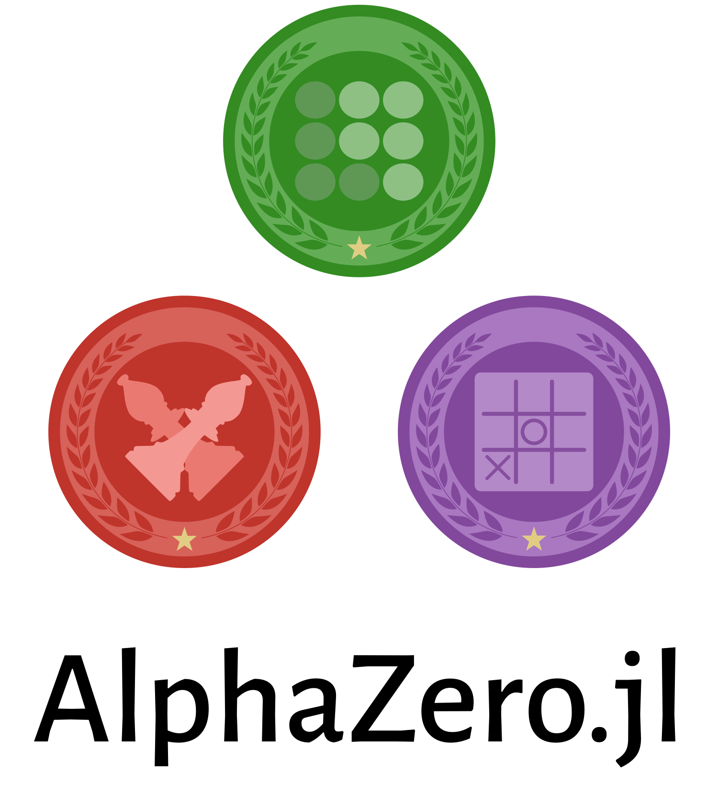

<p align="center">
  
</p>
<p align="center">
  <a href="https://jonathan-laurent.github.io/AlphaZero.jl/dev" alt="Dev">
    
  </a>
  <a href="https://jonathan-laurent.github.io/AlphaZero.jl/stable" alt="Stable">
    
  </a>
  <a href="https://travis-ci.com/jonathan-laurent/AlphaZero.jl" alt="Build Status">
    
  </a>
  <a href="https://codecov.io/gh/jonathan-laurent/AlphaZero.jl" alt="Codecov">
    
  </a>
</p>
<br/>

This package provides a _generic_, _simple_ and _fast_ implementation of
Deepmind's AlphaZero algorithm:

* The core algorithm is only 2,000 lines of pure, hackable Julia code.
* Generic interfaces make it easy to add support for new games or new learning
  frameworks.
* Being between one and two orders of magnitude faster than competing
  alternatives written in pure Python, this implementation can solve
  nontrivial games on a standard desktop computer with a GPU.
* The same agent can be trained on a
  [cluster of machines](https://www.youtube.com/watch?v=JVUJ5Oohuhs) as easily as on a
  single computer and without modifying a single line of code.

### Why should I care about AlphaZero?

Beyond its much publicized success in attaining superhuman level at games
such as Chess and Go, DeepMind's AlphaZero algorithm illustrates a more
general methodology of combining learning and search to explore large
combinatorial spaces effectively. We believe that this methodology can
have exciting applications in many different research areas.

### Why should I care about this implementation?

Because AlphaZero is resource-hungry, successful open-source
implementations (such as [Leela Zero](https://github.com/leela-zero/leela-zero))
are written in low-level languages (such as C++) and optimized for highly
distributed computing environments.
This makes them hardly accessible for students, researchers and hackers.

The motivation for this project is to provide an implementation of
AlphaZero that is simple enough to be widely accessible, while also being
sufficiently powerful and fast to enable meaningful experiments on limited
computing resources.
We found the [Julia language](https://julialang.org/) to be instrumental in achieving this goal.

### Training a Connect Four Agent

To download AlphaZero.jl and start training a Connect Four agent, just run:

```sh
export GKSwstype=100  # To avoid an occasional GR bug
git clone https://github.com/jonathan-laurent/AlphaZero.jl.git
cd AlphaZero.jl
julia --project -e 'import Pkg; Pkg.instantiate()'
julia --project -e 'using AlphaZero; Scripts.train("connect-four")'
```

<div>


</div>
<!--

  -->

<br/>

Each training iteration takes about one hour on a desktop
computer with an Intel Core i5 9600K processor and an 8GB Nvidia RTX
2070 GPU. We plot below the evolution of the win rate of our AlphaZero agent against two baselines (a vanilla MCTS baseline and a minmax agent that plans at depth 5 using a handcrafted heuristic):

<br/>
<div align="center">

</div>
<br/>

Note that the AlphaZero agent is not exposed to the baselines during training and
learns purely from self-play, without any form of supervision or prior knowledge.

We also evaluate the performances of the neural network alone against the same
baselines. Instead of plugging it into MCTS, we play the action that is
assigned the highest prior probability at each state:

<br/>
<div align="center">

</div>
<br/>

Unsurprisingly, the network alone is initially unable to win a single game.
However, it ends up significantly stronger than the minmax baseline despite not
being able to perform any search.

For more information on training a Connect Four agent using AlphaZero.jl, see our full [tutorial](https://jonathan-laurent.github.io/AlphaZero.jl/dev/tutorial/connect_four/).

### Resources

- [JuliaCon 2021 Talk](https://www.youtube.com/watch?v=nbLmR0aDumo)
- [Documentation Home](https://jonathan-laurent.github.io/AlphaZero.jl/dev/)
- [An Introduction to AlphaZero](https://jonathan-laurent.github.io/AlphaZero.jl/dev/tutorial/alphazero_intro/)
- [Package Overview](https://jonathan-laurent.github.io/AlphaZero.jl/dev/tutorial/package_overview/)
- [Connect-Four Tutorial](https://jonathan-laurent.github.io/AlphaZero.jl/dev/tutorial/connect_four/)
- [Solving Your Own Games](https://jonathan-laurent.github.io/AlphaZero.jl/dev/tutorial/own_game/)
- [Hyperparameters Documentation](https://jonathan-laurent.github.io/AlphaZero.jl/dev/reference/params/)

### Contributors

* Jonathan Laurent: main developer
* Pavel Dimens: logo design
* Marek Kaluba: hyperparameters tuning for the grid-world example
* Michał Łukomski: Mancala example, OpenSpiel wrapper
* Johannes Fischer: documentation improvements

Contributions to AlphaZero.jl are most welcome. Many contribution ideas are available in our [contribution guide](https://jonathan-laurent.github.io/AlphaZero.jl/dev/contributing/guide/).
Please do not hesitate to open a Github
[issue](https://github.com/jonathan-laurent/AlphaZero.jl/issues) to share
any idea, feedback or suggestion.


### Supporting and Citing

If you want to support this project and help it gain visibility, please consider starring
the repository. Doing well on such metrics may also help us secure academic funding in the
future. Also, if you use this software as part of your research, we would appreciate that
you include the following [citation](./CITATION.bib) in your paper.


### Related Julia Projects

- [AlphaGPU.jl](https://github.com/fabricerosay/AlphaGPU): an AlphaZero implementation inspired from the _"Scaling Scaling Laws with Board Games"_ [paper](https://github.com/andyljones/boardlaw), where almost everything happens on GPU (including the core MCTS logic). This implementation trades off some genericity and flexibility in exchange for unbeatable performances when used with small neural networks and environments that support batch-simulation on GPU.
- [ReinforcementLearning.jl](https://github.com/JuliaReinforcementLearning/ReinforcementLearning.jl): a reinforcement learning framework that leverages Julia's multiple dispatch to offer highly composable environments, algorithms and components. Future releases of AlphaZero.jl may build on this framework, as it gains better support for multithreaded and distributed RL.
- [POMDPs.jl](https://github.com/JuliaPOMDP/POMDPs.jl): a fast, elegant and well-designed framework for working with partially observable Markov decisions processes.


### Acknowledgements

This material is based upon work supported by the United States Air Force and
DARPA under Contract No. FA9550-16-1-0288 and FA8750-18-C-0092.
Any opinions, findings and conclusions or recommendations expressed in this material are
those of the author(s) and do not necessarily reflect the views of the United States
Air Force and DARPA.
