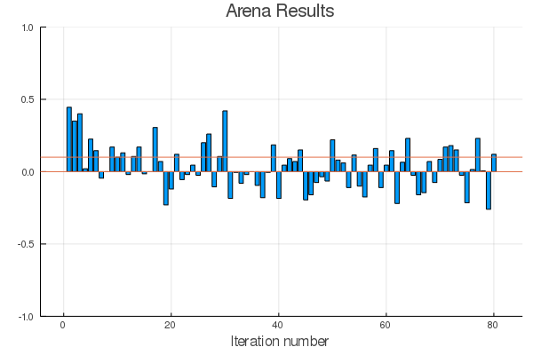
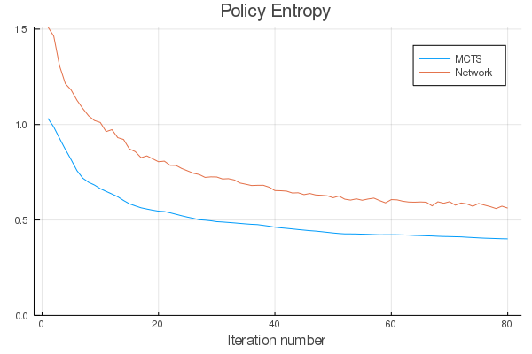
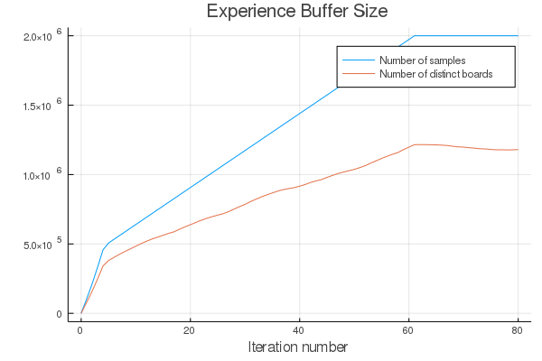
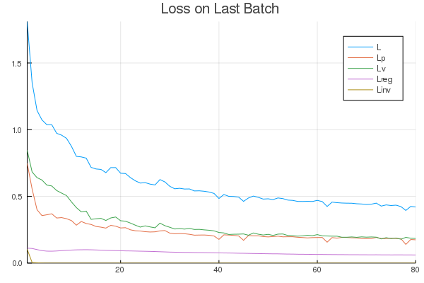
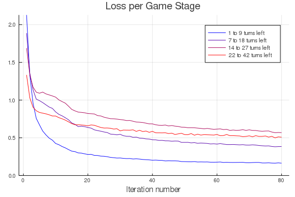
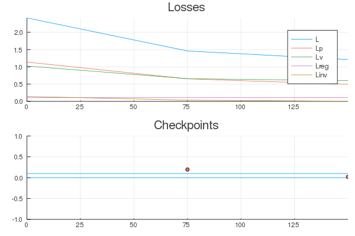

# [Learning to Play Connect Four](@id connect_four)

In this section, we discuss how to use `AlphaZero.jl` to train a
_Connect Four_ agent without any form of supervision or prior knowledge.
Although the game has been [solved](https://connect4.gamesolver.org/) exactly
with Alpha-beta pruning using domain-specific heuristics and optimizations, it
is still a great challenge for reinforcement learning.[^1]

[^1]:
    To the best of our knowledge, none of the many existing Python
    implementations of AlphaZero are able to learn a player that beats a
    minmax baseline that plans at depth 2 (on a single desktop computer).

## Training a Player on your own Machine

To run the experiments in this tutorial, we recommend having a CUDA
compatible GPU with 6GB of memory or more. Each training iteration took about
one hour and a half on a standard desktop computer with an Intel Core i5 9600K
processor and an Nvidia RTX 2070 GPU.

!!! note
    To get optimal performances, it is also recommended to use
    `AlphaZero.jl` with Julia 1.5 (nightly), which includes a
    [critical feature](https://github.com/JuliaLang/julia/pull/33448)
    that enables `CuArrays` to force incremental GC collections.

To download `AlphaZero.jl` and start a new training session,
just run the following:

```sh
git clone https://github.com/jonathan-laurent/AlphaZero.jl.git
cd AlphaZero.jl
julia --project -e "import Pkg; Pkg.instantiate()"
julia --project --color=yes scripts/alphazero.jl --game connect-four train
```

Instead of using the the `alphazero.jl` script, one can also run the following
into the Julia REPL:

```julia
ENV["CUARRAYS_MEMORY_POOL"] = "split"

using AlphaZero

include("games/connect-four/main.jl")
using .ConnectFour: Game, Training

const SESSION_DIR = "sessions/connect-four"

session = AlphaZero.Session(
    Game,
    Training.Network{ConnectFour.Game},
    Training.params,
    Training.netparams,
    benchmark=Training.benchmark,
    dir=SESSION_DIR)

resume!(session)
```

The first line configures CuArrays to use a splitting memory pool, which
performs better than the default binned pool on AlphaZero's workload as it
does not require to run the garbage collector as frequently. Then, a new
AlphaZero [session](@ref ui) is created with the following arguments:

| Argument             | Description                                                                     |
|:---------------------|:--------------------------------------------------------------------------------|
| `Game`               | Game type, which implements the [game interface](@ref game_interface).          |
| `Training.Network`   | Network type, which implements the [network interface](@ref network_interface). |
| `Training.params`    | AlphaZero [parameters](@ref params).                                            |
| `Training.netparams` | Network [hyperparameters](@ref conv_resnet).                                    |
| `Training.benchmark` | [Benchmark](@ref benchmark) that is run between training iterations.            |
| `SESSION_DIR`        | Directory in which all session files are saved.                                 |

## The Console User Interface


## Experimental Results










### Per iter




### Pons Benchmark


### Async Profiling


### Explorer


