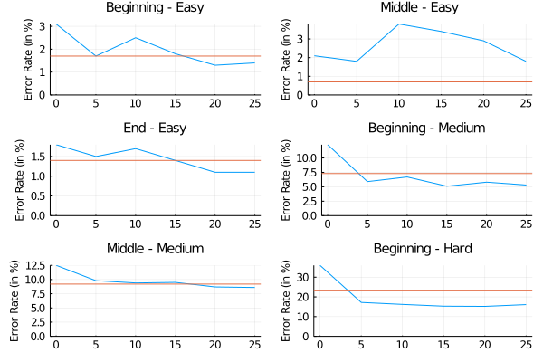

# [Training a Connect Four Agent](@id connect_four)

In this tutorial, we demonstrate AlphaZero.jl by training a _Connect Four_
agent without any form of supervision or prior knowledge. Although the game has
been [solved](https://connect4.gamesolver.org/) exactly with Alpha-beta pruning
using domain-specific heuristics and optimizations, it is still a great
challenge for reinforcement learning.[^1]

[^1]: To the best of our knowledge, none of the many existing Python
    implementations of AlphaZero are able to learn a player that beats a minmax
    baseline that plans at depth 2 (on a single desktop computer).

## Setup and Training

To run the experiments in this tutorial, we recommend having a CUDA compatible
GPU with 4GB of memory or more. A 2GB GPU should work fine but you may have to
reduce batch size. Each training iteration took about one hour and a half on a
desktop computer with an Intel Core i5 9600K processor and an 8GB Nvidia RTX
2070 GPU.

To download AlphaZero.jl and start a new training session, just run the
following:

```sh
git clone https://github.com/jonathan-laurent/AlphaZero.jl.git
cd AlphaZero.jl
julia --project -e "import Pkg; Pkg.instantiate()"
julia --project --color=yes scripts/alphazero.jl --game connect-four train
```

Instead of using `scripts/alphazero.jl`, one can also run the following using
the Julia REPL:

```julia
ENV["CUARRAYS_MEMORY_POOL"] = "split"

using AlphaZero

include("games/connect-four/main.jl")
using .ConnectFour: Game, Training

const SESSION_DIR = "sessions/connect-four"

session = AlphaZero.Session(
    Game,
    Training.Network{ConnectFour.Game},
    Training.params,
    Training.netparams,
    benchmark=Training.benchmark,
    dir=SESSION_DIR)

resume!(session)
```

The first line configures CuArrays to use a splitting memory pool, which
performs better than the default binned pool on AlphaZero's workload as it does
not require to run the garbage collector as frequently. Then, a new AlphaZero
[session](@ref ui) is created with the following arguments:

| Argument             | Description                                                                     |
|:---------------------|:--------------------------------------------------------------------------------|
| `Game`               | Game type, which implements the [game interface](@ref game_interface).          |
| `Training.Network`   | Network type, which implements the [network interface](@ref network_interface). |
| `Training.params`    | AlphaZero [hyperparameters](@ref params).                                            |
| `Training.netparams` | Network [hyperparameters](@ref conv_resnet).                                    |
| `Training.benchmark` | [Benchmark](@ref benchmark) that is run between training iterations.            |
| `SESSION_DIR`        | Directory in which all session files are saved.                                 |

The `ConnectFour.Training` module specifies the hyperparameters and
benchmarks that are used in this tutorial. Its content can be examined in file
`games/connect-four/params.jl`. We copy it for reference [at the end of this
tutorial](@ref c4-config). Here are some highlights:

- We use a [two-headed convolutional ResNet](@ref conv_resnet) similar to the
  one introduced in the AlphaGo Zero paper, although much smaller. Its tower
  consists of 7 residual blocks with 64 convolutional filters per layer, for a
  total of about 600K parameters (in contrast, the neural network from the
  AlphaGo Zero paper has about 100M parameters).
- During each iteration, the current agent plays 4000 games against itself,
  running 600 MCTS simulations to plan each move.[^2] The move selection
  temperature is set to 1.0 during the first ten moves of every game and then
  decreased to 0.5.
- Self-play data is accumulated in a memory buffer whose capacity grows from
  400K samples (initially) to 2M samples (at iteration 60). For reference,
  assuming an average game duration of 35 moves, about 35 x 4000 = 140K
  new samples are generated at each iteration.

[^2]:
    Compare those numbers with those of a popular [Python
    implementation](https://github.com/suragnair/alpha-zero-general), which
    achieves iterations of similar duration when training its Othello agent but
    only runs 100 games and 25 MCTS simulations per move.

### Initial Benchmarks

After launching the training script for the first time, you should see the
following:


Before the first training iteration and between each iteration, the current
AlphaZero agent is benchmarked against some baselines in a series of games (200
in this case) so as to provide a concrete measure of training progress. In this
tutorial, we use two baselines:

- A **vanilla MCTS** baseline that uses rollouts to estimate the value of new
  nodes.
- A **minmax baseline** that plans at depth 5 using a handcrafted heuristic.

Comparing two deterministic players is challenging as deterministic players will
always play the same game repeatedly given a unique initial state. To add
randomization, all players are instantiated with a small but nonzero move
selection temperature.[^3]

[^3]: Note, however, that the minmax baseline is guaranteed to play a winning
    move whenever it sees one and to avoid moves it can prove to be losing
    within 5 steps (see [`MinMax.Player`](@ref)).

The `redundancy` indicator is helpful to diagnose a lack of randomization. It
measures the quantity ``1 - u / n`` where ``u`` is the total number of unique
states that have been encountered (excluding the initial state) and ``n`` is the
total number of encountered states, excluding the initial state and counting
duplicates (see [`Benchmark.DuelOutcome`](@ref)).

!!! note "On leveraging symmetries"
    Another trick that we use to add randomization is to leverage the symmetry
    of the Connect Four board with respect to its central vertical axis: at each
    turn, the board is _flipped_ along its central vertical axis with a fixed
    probability (see [`flip_probability`](@ref Params)).

    This is one of two ways in which `AlphaZero.jl` takes advantage of
    board symmetries, the other one being data augmentation (see [`use_symmetries`](@ref Params)).
    Board symmetries can be declared for new games by implementing the [`GameInterface.symmetries`](@ref)
    function.

As you can see, the AlphaZero agent can still win some games with a randomly
initialized network, by relying on search alone for short term tactical
decisions.

### Training

After the initial benchmarks are done, the first training iteration can start.
Each training iteration took between 60 and 90 minutes on our hardware. The
first iterations are typically on the shorter end, as games of self-play
terminate more quickly and the memory buffer has yet to reach its final size.


Between the self-play and learning phase of each iteration, we perform an
**analysis of the memory buffer** by partitioning samples according to how many
moves remained until the end of the game when they were recorded. This is useful to
monitor how well the neural network performs at different game stages. Separate
statistics are also computed for the last batch of collected samples.

A description of all reported metrics can be found in [Training Reports](@ref reports).

At the end of every iteration, benchmarks are run, summary plots are generated
and the state of the current environment is saved on disk. This way, if training
is interrupted for any reason, it can be resumed from the last saved state by
simply running `scripts/alphazero.jl` again.

All summary plots generated during the training of our agent can be downloaded
[here](../assets/download/c4-plots.zip).

### Examining the current agent

At any time during training, you can start an [interactive command
interpreter](@ref explorer) to investigate the current agent:

```
julia --project --color=yes scripts/alphazero.jl --game connect-four explore
```


If you just want to play and not be bothered with metrics, you can substitute `explore` by
`play` in the command above.

## Experimental Results

We plot below the evolution of the win rate of our AlphaZero agent against our
two baselines:


It is important to note that the AlphaZero agent is never exposed to those
baselines during training and therefore cannot learn from them.

We also evaluate the performances of the neural network alone against the same
baselines: instead of plugging it into MCTS, we just play the action that is
assigned the highest prior probability at each state.


Unsurprisingly, the network alone is initially unable to win a single game.
However, it ends up being competitive with the minmax baseline despite not being
able to perform any search.

### Benchmark against a perfect solver

Finally, we benchmark our AlphaZero agent against a perfect Connect Four solver.
To do so, we evaluate the rate at which it makes mistakes on different test
datasets available
[here](http://blog.gamesolver.org/solving-connect-four/02-test-protocol/). Each
dataset gathers positions of similar game depth and level of difficulty.
More specificaly:

- A position is labelled __"Beginning"__ if it is at most 14 moves away from the
  beginning of the game. It is labelled __"End"__ if it is more than 28 moves
  away. Otherwise, it is labelled __"Middle"__.
- A position is labelled __"Easy"__ if it is less than 14 moves away from the
  end of the game given perfect play from both players. It is labelled
  __"Hard"__ if it is more than 28 moves away. Otherwise, it is labelled
  __"Medium"__.

On each dataset, we measure the mistake rate of our AlphaZero agent at different
stages of training. An action suggested by the agent is said to be _a mistake_ if
another action is available with a strictly higher optimal Q-value
(which can be either -1, 0 or 1). For example, the agent makes a mistake if it
plays an action that results in a losing or draw state (assuming perfect play
from both player) when another action exists that would have led to a winning state.

We plot the results below. The blue curves describe the mistake rate of our
AlphaZero agent as a function of the number of training iterations on different
datasets. The orange lines indicate the mistake rate of the minmax baseline.
This experiment can be replicated using the script at `games/connect-four/scripts/pons_benchmark.jl`.



As you can see, while our AlphaZero agent learns to make very few mistakes that
could be detected by planning up to 14 moves ahead, it is still imperfect at
making longer term strategical decisions. In particular, it does not learn
significantly better overtures compared to the minmax baseline.[^4]

[^4]:
    This also indicates that the heuristic we implemented for the minmax
    baseline is not too bad.

### You can do better!

The AlphaZero agent that is demonstrated in this tutorial went through little
hyperparameters tuning and it can certainly be improved significantly. We encourage you to make your own tuning
experiments and
[share](https://gitter.im/alphazero-jl/community?utm_source=badge&utm_medium=badge&utm_campaign=pr-badge)
the results.

The [Oracle
series](https://medium.com/oracledevs/lessons-from-alpha-zero-part-6-hyperparameter-tuning-b1cfcbe4ca9a)
discusses hyperparameters tuning for a Connect Four agent. However, their
configuration is optimized for more powerful hardware than is targeted by this
tutorial [^5] In particular, they use a network that is about ten times larger
and generate twice as much training data per iteration.

Our current configuration results from an attempt at downscaling Oracle's setup.
Doing so is not trivial as hyperparameters are interrelated in a complex
fashion. For example, we found that reducing exploration slightly results in
faster training for our downscaled agent. Also:

  - We chose to use the Adam optimizer instead of SGD with cyclical rates, as it
    introduces less hyperparameters and is generally more forgiving.
  - Raising the number of MCTS simulations per move from 300 to its current
    value of 600 resulted in faster learning, despite the additional
    computational cost per iteration.

Apart from that, most hyperparameters are the result of a single guess.
We are looking forward to seeing how you can improve our Connect Four agent, with or without the help of better hardware!

[^5]:
    Their closed-source C++ implementation of AlphaZero is also faster. A big
    part of the difference is apparently coming from them using Int8 quantization to
    accelerate network inference. See [Contributions Guide](@ref contributions_guide).


## [Full Training Configuration](@id c4-config)

Here, we copy the full content of the configuration file
`games/connect-four/params.jl` for reference.

Note that, in addition to having standard keyword constructors, parameter types
have constructors that implement the _record update_ operation from functional
languages. For example, `Params(p, num_iters=100)` builds a `Params` object that
is identical to `p` for every field, except `num_iters` which is set to `100`.

```julia
Network = ResNet

netparams = ResNetHP(
  num_filters=64,
  num_blocks=7,
  conv_kernel_size=(3, 3),
  num_policy_head_filters=32,
  num_value_head_filters=32,
  batch_norm_momentum=0.1)

self_play = SelfPlayParams(
  num_games=4_000,
  reset_mcts_every=100,
  mcts=MctsParams(
    use_gpu=true,
    num_workers=64,
    num_iters_per_turn=600,
    cpuct=2.0,
    temperature=StepSchedule(
      start=1.0,
      change_at=[10],
      values=[0.5]),
    dirichlet_noise_ϵ=0.25,
    dirichlet_noise_α=1.0))

arena = ArenaParams(
  num_games=200,
  reset_mcts_every=nothing,
  flip_probability=0.5,
  update_threshold=0.1,
  mcts=MctsParams(
    self_play.mcts,
    temperature=StepSchedule(0.1),
    dirichlet_noise_ϵ=0.05))

learning = LearningParams(
  use_position_averaging=true,
  samples_weighing_policy=LOG_WEIGHT,
  batch_size=2048,
  loss_computation_batch_size=2048,
  optimiser=Adam(lr=1e-3),
  l2_regularization=1e-4,
  nonvalidity_penalty=1.,
  min_checkpoints_per_epoch=1,
  max_batches_per_checkpoint=1000,
  num_checkpoints=2)

params = Params(
  arena=arena,
  self_play=self_play,
  learning=learning,
  num_iters=80,
  ternary_rewards=true,
  use_symmetries=true,
  memory_analysis=MemAnalysisParams(
    num_game_stages=4),
  mem_buffer_size=PLSchedule(
  [      0,        60],
  [400_000, 2_000_000]))

baselines = [
  Benchmark.MctsRollouts(
    MctsParams(
      arena.mcts,
      num_iters_per_turn=1000,
      cpuct=1.)),
  Benchmark.MinMaxTS(depth=5, τ=0.2)]

make_duel(baseline) =
  Benchmark.Duel(
    Benchmark.Full(arena.mcts),
    baseline,
    num_games=200,
    flip_probability=0.5,
    color_policy=CONTENDER_WHITE)

benchmark = make_duel.(baselines)
```
