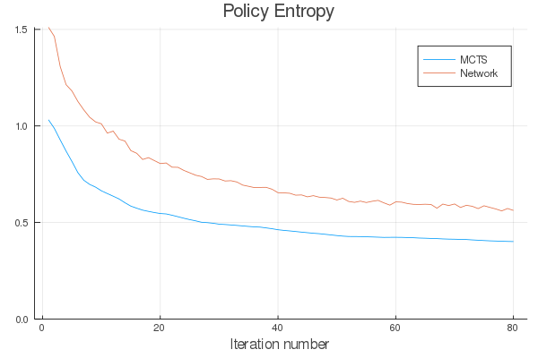
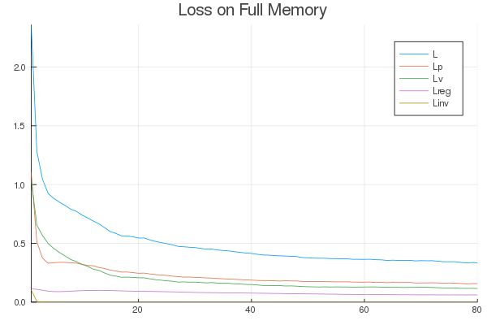
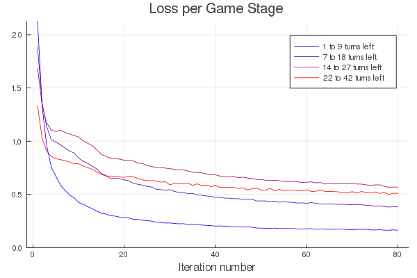
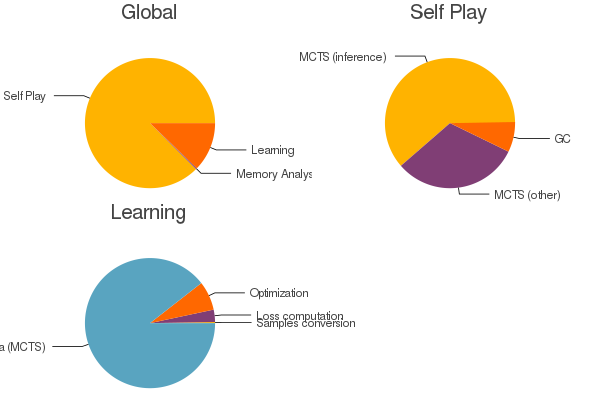
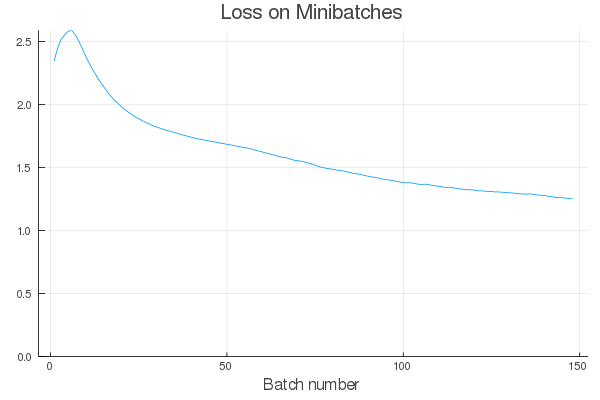

# Package Overview

The philosophy of this project is to provide an implementation of the AlphaZero
algorithm that is simple enough to serve as a valuable pedagogical resource,
while also being sufficiently flexible and fast to enable meaningful experiments
on limited computing resources.

In this section, we describe some key features of AlphaZero.jl:
  - An asynchronous MCTS implementation
  - A series of optional optimizations to increase training efficiency
  - Generic interfaces for games and neural networks
  - A simple user interface to get started quickly and diagnose problems

### [Asynchronous MCTS](@id async_mcts)

A key MCTS optimization that is implemented in AlphaZero.jl is to allow several
workers to explore the search tree asynchronously. Doing so requires a bit of
care to ensure that all workers are not always exploring the same branch simultaneously,
which is done by introducing a [virtual
loss](https://blogs.oracle.com/developers/lessons-from-alpha-zero-part-5:-performance-optimization)
mechanism.

Perhaps surprisingly, our implementation is fully sequential and workers are *not* scheduled on
multiple cores. However, the real gain comes from enabling game positions to be evaluated by the neural network in large batches, thereby maximizing the GPU utilization.

To quantify this phenomenon, we plot below the resulting speedup on self-play data generation
for our [connect four agent](@ref connect_four) as a function of the number of asynchronous
workers. Using `scripts/profile/async_mcts.jl` on our machine, we obtain a 25x speedup for
128 workers:


Note that the virtual loss induces an exploration bias that can become significant when
the number of workers gets too close to the total number of MCTS simulations performed. For this
reason, we only use 64 workers in our connect four [experiment](@ref connect_four) and settle for a 20x speedup.

We implemented MCTS (both synchronous and asynchronous) in a standalone [module](@ref mcts).
Thanks to Julia's great support
for [coroutines](https://docs.julialang.org/en/v1/manual/control-flow/#man-tasks-1), adding
support for asynchronicity from a vanilla implementation turned out to only be a matter of
doing some minor refactoring and adding a few dozens lines of additional code.

### Optional Optimizations

AlphaZero.jl has out-of-the-box support for many of the optimizations introduced in [Oracle's series](https://medium.com/oracledevs/lessons-from-implementing-alphazero-7e36e9054191) and also implements new ones. 
These include:

- Position averaging
- Memory buffer with growing window
- Cyclical learning rates
- Symmetry-based data augmentation and game randomization

All these optimizations are referenced in the [Training Parameters](@ref params) section of the manual.

### Game Interface

You can use AlphaZero.jl on the game of your choice by simply implementing the [Game Interface](@ref game_interface). Currently, there is only support for two-players, symmetric[^1], zero-sum games with finite action spaces and perfect information. Ultimately, the plan is to
[lift some of these restrictions](@ref contrib_generalize) though.

[^1]:
    We call a game _symmetric_ when the rules are the same for both players.
    Said differently, it is always possible to swap the players' colors along
    with the color of every piece on the board without affecting the game.

The best way to learn about the game interface, in addition to reading the [documentation](@ref game_interface) is to look at existing examples such as `games/connect-four/game.jl`.


### Network Interface

AlphaZero.jl is agnostic to the choice of deep learning framework and allows you to plug any neural network that implements the [Network Interface](@ref network_interface).
For convenience, we provide a [library](@ref networks_library) of standard networks
based on Knet. Right now, it features templates for two-headed multi-layer perceptrons and
convolutional resnets.

### User Interface and Utilities

AlphaZero.jl comes with _batteries included_. It comes with a simple 
user interface that provides utilities for logging, profiling, benchmarking
and model exploration.

```@raw html
<div>







<!---->
</div>
```