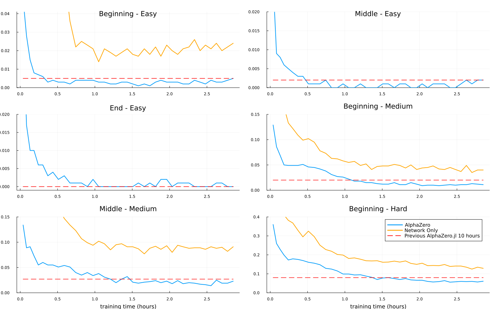

# Redesign of AlphaZero.jl

This repository is the result of Andreas Spanopoulos' contribution to the redesign of the
[AlphaZero.jl](https://github.com/jonathan-laurent/AlphaZero.jl) open-source AlphaZero
implementation in Julia. The aims of this redesign are:

1. **Code readability and maintainability.**
2. **Code modularity and extensibility.**
3. **Code performance.**

The redesign is based on the original implementation by
[Jonathan Laurent](https://www.cs.cmu.edu/~jlaurent/), who is the main author of AlphaZero.jl,
and the mentor of this project.


## When can AlphaZero be used?

AlphaZero is a general-purpose reinforcement learning algorithm introduced by
[Google Deepmind](https://www.deepmind.com/) that can be used to train agents for two-player
zero-sum games. Since any single-player game can be extended into a two-player zero-sum game
just by adding a dummy player that never plays and receives the opposite reward of the
player that is being trained, AlphaZero can also be used to train agents for single-player games.

AlphaZero is a model-based reinforcement learning algorithm, which means that it leverages a
model of the environment to train the agent. This means that the transition dynamics of the
environment must be known and deterministic. For unknown and/or stochastic environments,
the user can refer to [MuZero](https://arxiv.org/pdf/1911.08265.pdf) and
[Stochastic MuZero](https://openreview.net/pdf?id=X6D9bAHhBQ1).

Furthermore, this implementation will work better when the number of possible actions in
an environment is relatively small. This is due to the fact that the tree in the MCTS
algorithm is implemented with an array, and therefore for games like chess were there
are more than 4000 possible actions, even though the legal ones may be much less
in any given state, the memory requirements will be extremely high, thus forcing the
user to use a small batch of environments, which cancels the benefits of this implementation.


## What's different from AlphaZero.jl?

The main bottleneck when training AlphaZero-like agents is the self-play phase. The slowness of
this phase is usually due to the Monte Carlo Tree Search (MCTS) algorithm, which is used during
action selection. In the original AlphaZero.jl implementation, the MCTS algorithm runs the
environments simulations on CPU, and the neural network inference on GPU. This is not optimal,
since the GPU is not used to its full potential, and there's a lot of data transferring between
devices.

In this redesign, the MCTS algorithm runs fully on GPU. By fully, we mean that the environment
functions, the neural network inference, and the MCTS algorithm itself, all run on GPU, like
in [[Jones, 2021]](https://arxiv.org/pdf/2104.03113.pdf). This allows us to parallelize the MCTS
algorithm across a batch of environments, thus unlocking the full potential of the GPU, and
creating training data much faster during the self-play phase.

Furthermore, a new variant of MCTS called **Gumbel MCTS**
[[Danihelka et al., 2022]](https://openreview.net/pdf?id=bERaNdoegnO) has been implemented.
This variant allows for more efficient exploration, and thus faster training.


## What's different from other implementations that do the same thing?

There are other open-source implementations of AlphaZero that run the MCTS algorithm fully on GPU,
such as [boardlaw](https://github.com/andyljones/boardlaw) and
[AlphaGPU](https://github.com/fabricerosay/AlphaGPU). However, these implementations lack the
following:

- **Two-language problem**. Python's weaknesses (no parallelism due to
    [GIL](https://tenthousandmeters.com/blog/python-behind-the-scenes-13-the-gil-and-its-effects-on-python-multithreading/),
    slow interpreter performance) require users to write the performance-critical parts of the
    environment in C/Cython/Numba/JAX.
- **Code readability and maintainability.** Code quality in some cases is not
    great, and thus it's hard to understand what's going on, let alone extend the codebase
    with new features.

This redesign aims to solve these problems by using Julia, a high-level, high-performance
programming language, which is also very easy to learn and use. The way Julia addresses
these issues is by:

- Utilizing [CUDA.jl](https://github.com/JuliaGPU/CUDA.jl), it's possible to write code
    that runs **both** on CPU and GPU, without having to write two separate implementations.
    This allows us to write the environment implementation in Julia, without resorting to
    another language or framework for performance-critical parts.
- Julia's syntax is very similar to Python's, and it's easy to understand. By documenting
    the code thoroughly, we can make it accessible to anyone who wants to learn how AlphaZero
    works, and how to extend it with new features.


## Repository structure

The repository is structured as follows:

- [src](src): Contains the source code of the redesigned AlphaZero. The main components
    are `MCTS`, the `Network` library, the `ReplayBuffer`, the `Train` function and utilities,
    and some other. A more in-depth explanation can be found on [src/README.md](src/README.md).
- [examples](examples): Contains example scripts that showcase how to use the redesigned
    AlphaZero both for single-player and 2-player environments, for both CPU and GPU devices.
- [test](test): Contains the tests of the redesigned AlphaZero. The tests
    cover all the main components of the codebase. More details can be found in
    [test/Tests/README.md](test/Tests/README.md).


## Installation

First, we have to clone the repository of the redesigned AlphaZero:

```shell
$ git clone https://github.com/AndrewSpano/AlphaZero.jl.git
$ cd AlphaZero.jl
$ git checkout dev
$ cd redesign
```

For the project to run, julia has to be installed. If it isn't, the following
[installation script](install_julia_1.9.3.sh), which installs julia 1.9.3, can
be consulted. It can be run as follows:

```shell
$ ./install_julia_1.9.3.sh
```

Then, we have to instantiate the project:

```shell
$ julia --project=. -e 'using Pkg; Pkg.instantiate()'
```

## Running tests

```shell
$ cd AlphaZero.jl/redesign
$ julia --project=. test/runtests.jl
```


## Training AlphaZero

To train an AlphaZero agent using this package, the following components must be
implemented by the user:

1. The environment/game to train on. Note that if user wishes to use a GPU, the
    environment implementation has to be GPU-friendly. Refer to
    [BatchedEnvs.jl](src/BatchedEnvs.jl) for the definition of GPU-friendliness.
2. The Neural Network to train. The user can either use neural networks from
    the [Network.jl](src/Networks/Network.jl) library provided by this package, or
    implement their own. If the user wishes to use their own implementation, it
    has to adhere to the interface defined in [Network.jl](src/Networks/Network.jl).
3. \[Optional, but highly recommended\]: Evaluation functions to assess the performance
    of agents during training. Since the policy/value/total losses don't always correlate
    with the actual performance of the agent, it's recommended to use evaluation functions
    to determine whether the agent is learning or not, during the self-play phase. The
    user can refer to [Evaluation.jl](src/Evaluation.jl) for the definition of evaluation
    functions and their specific format, as well as to
    [EvaluationFunctions](test/Tests/Common/Evaluation/EvaluationFunctions/) for examples.
4. Training Parameters/Hyperparameters. The user can refer to
    [TrainUtilities.jl](src/TrainUtilities.jl) where the `TrainConfig` structure is
    defined. This structure holds all the key information, and can uniquely define
    a training session.
5. The script that glues all of the above together. The user can refer to
    [examples](examples) for examples of how to do this.


A general overview of the code needed to train an AlphaZero agent is as follows:

```julia
using RLZero.BatchedEnvs
using RLZero.Train: selfplay!
using RLZero.TrainUtilities: TrainConfig
using RLZero.Util.Devices

using Flux

# define the device on which MCTS and NN training will run
device = MyDevice()  # `CPU()` or `GPU()`

# define the NN and place it in the corresponding device
nn = MyNN()
if device == GPU()
    nn = Flux.gpu(nn)
end

# define parameters/hyperparameters for training
config = TrainConfig(
    EnvCls=MyEnv,                           # the struct that defines the environment
    env_kwargs=Dict(:kwarg1 => val1, ...),  # custom kwrags for the environment
    num_envs=num_envs,                      # number of environments to run in parallel
    # ...                                   # other parameters
    eval_fns=[my_eval_fn1, ...],            # evaluation functions
    num_steps=num_steps                     # number of total steps to run during self-play
)

# train
trained_nn, execution_times = selfplay!(config, device, nn)
```


## Training Examples

1. [RandomWalk1D](examples/random_walk_gumbel_alphazero.jl): A simple one-player
    environment, where an agent sits on a straight line, and can move left or right.
    The goal is to reach the end of the line, which is at the rightmost position.
    This environment serves mostly as a sanity check for the correctness of the
    implementation. Training can be launched with the following comman:

    ```shell
    julia --project=. examples/random_walk_gumbel_alphazero.jl
    ```

2. [TicTacToe](examples/tictactoe_alphazero.jl): A two-player environment, where
    two agents play [TicTacToe](https://playtictactoe.org/) against each other. This
    environment also serves as a sanity check due to it's small state space. Training
    can be launched with the following command:

    ```shell
    julia --project=. examples/tictactoe_alphazero.jl
    ```

3. [Connect-Four](examples/connect_four_alphazero.jl): A two-player environment, where two
    agents play [Connect4](https://en.wikipedia.org/wiki/Connect_Four) against each
    other. This environment is more complex than TicTacToe, and thus it's a good
    benchmark for the performance of the redesigned AlphaZero. Training can be launched
    with the following command:

    ```shell
    julia --project=. examples/connect_four_alphazero.jl
    ```


##  Evaluation

To assess whether the redesigned AlphaZero has been implemented correctly, we can
evaluate the performance of the trained agents for the available environments.
The example scripts mentioned in the previous section can be run to get the
evaluation plots/results. Since each environment is different, we will be looking
at different ways to evaluate the performance of AlphaZero in each one of them.

#### RandomWalk1D

In a simple environment like RandomWalk1D, we actually know what the optimal policy
corresponds to; it's the policy that always moves right (second action). Since running
AlphaZero is guaranteed to solve the game, it might be of more interest to test
just the Neural Network in an environment, to see how it performs.

The Neural Network will play for 10 episodes. In each episode, we will be sampling
actions to play in the environment from the from the categorical distribution produced by the
policy head. As training progresses, we would like to see the following things occur:

- The average number of steps taken to solve the game should decrease, to a minimum
    of 5 steps (since 5 steps are the minimum number of steps needed to solve the game).
- The win rate (number of games solved divided by total number of games played) of the
    Neural Network should converge to 1.
- The average probability of choosing the optimal action (going right) should converge
    to 1.

Indeed, the plots show that all of the above occur:

<p align="center">
  
</p>

#### TicTacToe

While TicTacToe is a more complicated game than RandomWalk1D, it still has a relatively
small state space. An initial naive approximation would assume that there are 9! = 362880
states, but this is not the case due to the fact that a) Not all 9! positions can be
reached from the starting position either because they're invalid, or the game would
terminate earlier, and b) Different sequences of actions can lead to the same state
(e.g. action sequences [1, 2, 3] and [3, 2, 1] lead to the same state).

In fact, calculating the total number of states in TicTacToe is not trivial, but it
can be done using brute-force. By running a minimax search from the root state, we
can

1. Traverse and store all the different states since the tree is not that big.
2. Store the optimal policy for every state encountered.

This shows that there are ~4.500 different states (excluding those where only 1 action
is available).

By having a list of all the states and their optimal policies, we can run MCTS and
Neural Network inference on all of them, and see whether the selected actions belong
to the optimal policy. This metric is defined as accuracy, and we can see it in the
bottom plot at the image below. The plots above show win/loss/draw percentages against
random and minimax agents of various depths. This isn't of particular value, but it can
help us distinguish whether the policy head is converging to the optimal policy or not.

To asses whether the agent is learning, we would expect to see:

1.  - Win rate against random agents to converge to 1.
    - Loss rate against random agents to converge to 0.
    - Draw rate against random agents to converge to 0.
    <br></br>
2.  - Win rate against minimax agents to converge to 0.
    - Loss rate against minimax agents to converge to 0.
    - Draw rate against minimax agents to converge to 1.
    <br></br>
3. The accuracy in the all-states-optimal-policy-benchmark to converge to 1.

Indeed, the plots below show that our expectations are met:

<p align="center">
    
</p>

#### Connect-Four

Connect-Four is a much more complicated game than TicTacToe, as it has a much larger
state space. The previous version of AlphaZero.jl manages to train a superhuman agent
in ~10 hours
[[1]](https://jonathan-laurent.github.io/AlphaZero.jl/stable/tutorial/connect_four/#Benchmark-against-a-perfect-solver).
To consider the redesigned AlphaZero.jl a success, we would like to see it achieve similar
results in a shorter amount of time. To assess the performance of the agent during training,
we will:

1. Pit the Neural Network against Random and Minimax (width depth 5 and a strong heuristic)
    agents, and plot the win/loss/draw percentages. We expect the win rates to converge
    to 1 and the loss/draw rates to converge to 0.
2. Sample random Connect-Four states, use [Pascal Pons'](https://github.com/PascalPons)
    [perfect solver](https://github.com/PascalPons/connect4) to compute the optimal policy
    in those states (like in TicTacToe), and track the accuracies of AlphaZero and the
    Neural Network by itself. We expect the accuracies to converge to 1.
3. This step is similar to the previous one, but instead of sampling random states, we
    will use the
    [benchmark](http://blog.gamesolver.org/solving-connect-four/02-test-protocol/) created
    by Pascal Pons. This benchmark consists of 6.000 states or various difficulties, and
    it was used to evaluate the performance of the original AlphaZero.jl. Thus, by using
    the same benchmark and the same simulation budget during evaluation, we will be able
    to make a fair comparison in terms of performance.

For the first two evaluation groups, we can see the results in the following plots.
The first 6 plots correspond to the first group, while the last corresponds to the
second:

<p align="center">
    
</p>

For the third group, we can see the results in the following plot:

<p align="center">
    
</p>

As we can see, the redesigned AlphaZero.jl manages to train a superhuman agent in
~1.5 hours, which amounts to a ~6.25x speedup compared to the original AlphaZero.jl.
By tuning hyperparameters, it is certainly possible to achieve even faster convergence.

The hyperparameters used to achieve the above results can be found in
[connect_four_alphazero.jl](examples/connect_four_alphazero.jl), while the hyperparameters
for the experiment of the original AlphaZero.jl can be found
[here](https://jonathan-laurent.github.io/AlphaZero.jl/stable/tutorial/connect_four/#c4-config).
Note that in both cases, the same evaluation-MCTS-budget (600 simulations) was used.

Apart from these assessments, the Neural Network (NN) was evaluated against three average
human players. Each human played a total of 10 games, 5 with the Cross (X) symbol (plays
first) and 5 with the Nought (O) symbol (plays second). Actions from the NN were selected
as the argmax of the policy head, out of all the valid actions. The results are as follows:

|  Opponent  | NN Win Rate | NN Loss Rate | NN Draw Rate |
| :--------: | :---------: | :----------: | :----------: |
|   Human 1  |    100%     |       0%     |       0%     |
|   Human 2  |    100%     |       0%     |       0%     |
|   Human 3  |     90%     |      10%     |       0%     |

Out of the 30 games played, the NN won 29, lost 1 and drew 0.

### Hardware

- CPU: Intel(R) Xeon(R) CPU E5-2603 v4 @ 1.70GHz
- GPU: NVIDIA Tesla V100-PCIE-16GB

### Reproducing the results

To reproduce the above plots, the example scripts mentioned in the previous section must be run. But note that due to julia's JIT compilation, the first time the scripts are run, they'll
take longer to finish. This will result in slightly slower train times. The difference will
be negligible for larger experiments, such as Connect Four's.

Yet, it is possible to reproduce the exact results, by launching a julia REPL, running the
code once to trigger JIT compilation (just for a few iterations), and then running the code
again in the same REPL.


## Future Work

- Monte Carlo Tree Search (MCTS)

    The current batched MCTS implementation has been built on top Guillaume Thomas'
    [work](https://medium.com/@guillaume.thopas/an-almost-full-gpu-implementation-of-gumbel-muzero-in-julia-1d64b2ec04ca), which
    introduces two variants: Structure of Arrays (SoA) and Array of Structures (AoS).
    The [code](https://github.com/jonathan-laurent/AlphaZero.jl/pull/147) that was delivered
    by Guillaume was untested, had breaking bugs and the results couldn't be reproduced.
    The current implementation is a fully-functional and fully-tested rewrite of the
    original code, but only for the SoA variant. Thus, for future work regarding MCTS:

    - [] Fix/test/document the AoS batched MCTS variant.
    - [] Add support for using the MCTS tree from previous iterations, to improve exploration.
    - [] Add improved MCTS algorithms and/or action selection strategies, such as in
        [[Grill et al. 2020]](https://arxiv.org/pdf/2007.12509.pdf).
    
    <br>

- Multithreading, Multiprocessing and Multi-GPU Support

    The current self-play phase implementation makes use of a single device, either a CPU
    or a GPU. It would greatly speed-up the process if we could leverage multiple devices
    at the same time. This would require a slight re-write of the self-play phase, but the
    speed gains would outweigh the effort.

    - [] Add support for multithreading, multiprocessing during self-play.
    - [] Add support for parallelization of Baatched MCTS over mutiple GPUs, as well as
        for the Neural Network training.

    <br>

- More Neural Network Libraries

    In the current implementation, the only "ready-to-use" Neural Network models are
    Multi-Layer Perceptrons (MLPs) and Residuals MLPs. While these are enough to train
    agents for environments such as Connect-Four, they may not produce good results for
    more complex environments.

    - [] Add CNNs and Residual CNNs (like the ones used in the original AlphaGoZero paper).
    - [] Add RNN and transformer models.

    <br>

- Batteries included

    The current implementation lacks the mechanism to automatically check whether a user-defined
    environment is GPU-friendly or adheres to the [BatchedEnvs.jl](src/BatchedEnvs.jl) interface.
    If the user doesn't have much experience with GPU programming in Julia, it might be hard for
    them to understand how to write GPU-friendly code. Furthermore, currently there are no
    functions for tuning the hyperparameters of AlphaZero. This is a big problem, since
    hyperparameter tuning is a very important part of training AlphaZero-like agents.

    - [] Add a function that checks whether a user-defined environment is GPU-friendly.
    - [] Add a function that checks whether a user-defined environment adheres to the
        [BatchedEnvs.jl](src/BatchedEnvs.jl) interface.
    - [] Add a function that checks whether custom Neural Networks adhere to the
        [Network.jl](src/Networks/Network.jl) interface.
    - [] Add hyperparameter tuning utilities with quasi-random search methods.

    <br>

- More logging

    The current logging system is not very informative, as it currently only logs the
    value/policy/total losses, and relies on the user to log other information during
    the evaluation function calls. Thus, for future work regarding logging:

    - [] Add more logging information during training, such as average episode length,
        average reward (for single-player games), iteration time, etc..
    - [] Log/save all imprortant metrics on files instead of having them in memory.

    <br>

- API

    The current API is not the most user-friendly, and thus some users might find it hard
    to understand. This is due to the fact that the redesign was focused on the performance
    of the code. Thus, for future work regarding the API:

    - [] Rewrite the API such that the user can train agents with fewer lines of code.
    - [] Add more tutorials for how to use the package.
    - [] Add wrapper functions for MCTS/Network-Only inference (like what is done in
        [interactive_play.jl](examples/interactive_play.jl)).

    <br>


## Acknowledgements

I would like to thank the [Julia organization](https://julialang.org/) for founding this
project via their [Julia Summer of Code](https://julialang.org/jsoc/archive/) program,
as well as my mentor Jonathan Laurent, who taught me invaluable lessons about programming
and software engineering practices, and mentored me throughout the summer.